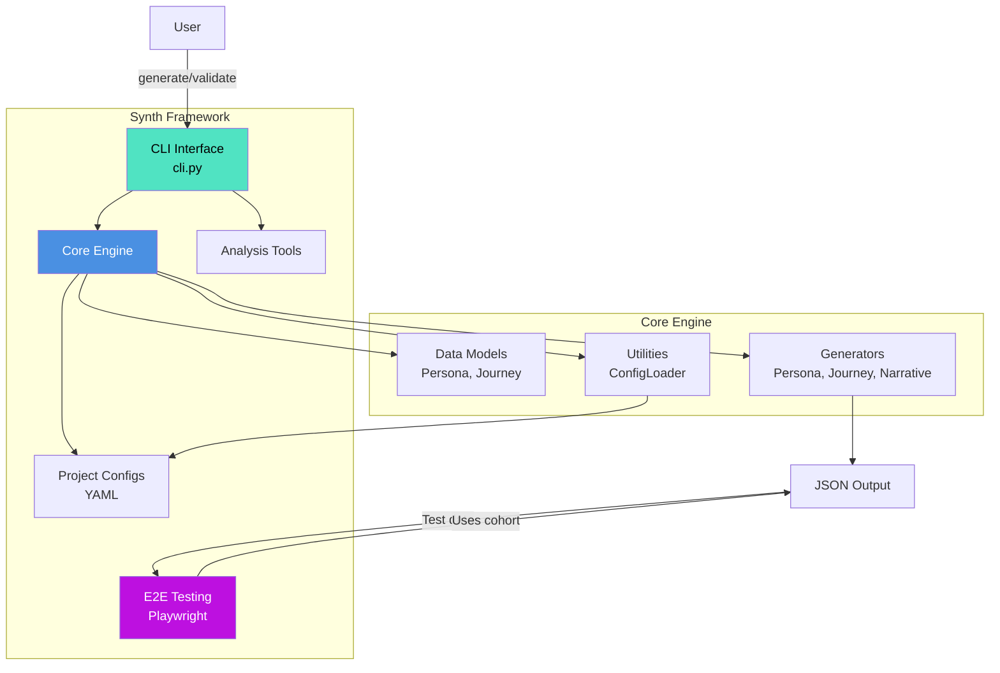
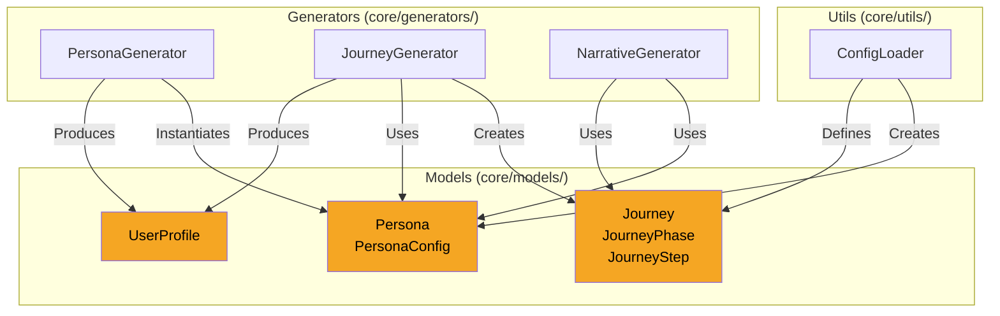

# C4 Architecture Model

This document describes the Synth architecture using the [C4 model](https://c4model.com/) framework.

## Level 1: System Context


**Purpose:** Synth generates realistic synthetic user data across multiple domains using persona archetypes and journey phase modeling.

**Users:**
- Product Developers (test features against realistic users)
- UX Researchers (model user journeys and pain points)
- Marketing Teams (create persona-based scenarios)
- Data Scientists (generate training datasets)

**External Dependencies:**
- YAML configuration files (project definitions)
- Faker library (demographic data generation)
- Python standard library (data processing)

## Level 2: Container Diagram



**Containers:**

1. **CLI Interface** (`cli.py`)
   - Command-line interface for generation
   - Project validation
   - User-facing entry point

2. **Core Engine** (`core/`)
   - Domain-agnostic generation logic
   - Data models and algorithms
   - Configuration management

3. **Project Configs** (`projects/`)
   - YAML configuration files
   - Persona definitions
   - Journey structures
   - Emotional progressions

4. **Analysis Tools** (`analyze_*.py`)
   - Scenario analysis
   - Cohort reporting
   - User story generation

5. **E2E Testing Framework** (`src/tests/e2e/`)
   - Persona-based Playwright tests
   - Test fixtures from synthetic cohort
   - Beta test simulation
   - Adaptive test behaviors

## Level 3: Component Diagram - Core Engine



**Components:**

### Data Models (`core/models/`)

**Persona** (`persona.py`)
- Behavioral archetype definition
- Demographics (age, gender, education)
- Engagement patterns
- Completion thresholds
- Domain-specific attributes

**Journey** (`journey.py`)
- User progression through phases
- Journey types (time/session/milestone)
- Phase definitions and objectives
- Step-by-step tracking
- Completion status

**UserProfile** (`user_profile.py`)
- Complete user representation
- Combines persona + journey
- Metadata and timestamps
- Exportable to JSON

### Generators (`core/generators/`)

**PersonaGenerator** (`persona_generator.py`)
```python
Input:  Dict[str, PersonaConfig]
Output: List[Persona]

Responsibilities:
- Calculate persona distribution
- Generate demographic attributes
- Apply weighted random selection
- Validate persona instances
```

**JourneyGenerator** (`journey_generator.py`)
```python
Input:  Persona, JourneyType, List[JourneyPhase]
Output: Journey

Responsibilities:
- Generate journey steps
- Apply journey type logic (time/session/milestone)
- Track emotional progressions
- Calculate completion rates
```

**NarrativeGenerator** (`narrative_generator.py`)
```python
Input:  Persona, JourneyStep, Prompt
Output: str (narrative response)

Responsibilities:
- Generate persona-appropriate responses
- Apply linguistic markers
- Vary response length
- Match emotional state
```

### Utilities (`core/utils/`)

**ConfigLoader** (`config_loader.py`)
```python
Input:  Path to project directory
Output: Parsed configurations

Responsibilities:
- Load and parse YAML files
- Validate configuration schema
- Convert to Python dataclasses
- Handle errors gracefully
```

## Level 4: Code - Journey Generation Flow


**Key Algorithms:**

### 1. Persona Distribution
```python
def _calculate_distribution(count: int) -> Dict[str, int]:
    """Distribute users across personas"""
    # Sort by distribution descending
    # Round to integers
    # Assign remainder to largest persona
    # Ensure total = count
```

### 2. Journey Step Generation (Session-Based)
```python
def _generate_session_based_steps(persona, journey):
    """Generate variable-interval sessions"""
    total_sessions = random.randint(5, 20)

    for session in range(total_sessions):
        # Pick phase based on session number
        phase_idx = min(session // 3, len(phases) - 1)

        # Create step with realistic timing
        interval = random.randint(1, 14)  # days
        current_time += timedelta(days=interval)

        # Determine completion based on persona
        completed = random.random() < persona.engagement_level
```

### 3. Emotional State Selection
```python
def _create_step(phase, persona):
    """Assign phase-appropriate emotion"""
    # Get emotions for this persona type
    persona_emotions = emotional_states[persona.persona_type]

    # Get emotions for current phase
    phase_emotions = persona_emotions[phase.name]

    # Random selection from phase-appropriate list
    emotional_state = random.choice(phase_emotions)
```

## Data Flow


1. **YAML Configs** → Parsed by ConfigLoader
2. **Configurations** → Used to generate Personas
3. **Personas** → Input to Journey generation
4. **Journeys** → Enhanced with Narratives
5. **Complete Users** → Exported to JSON

## Technology Stack

| Layer | Technology | Purpose |
|-------|-----------|---------|
| **Interface** | Python CLI | User commands |
| **Core Logic** | Python 3.8+ | Generation algorithms |
| **Data Models** | dataclasses | Type-safe structures |
| **Configuration** | PyYAML | Config parsing |
| **Data Generation** | Faker | Realistic demographics |
| **Output** | JSON | Exportable datasets |
| **Testing** | pytest | Unit/integration tests |

## Deployment

**Current:** Local execution
```bash
python cli.py generate project_name --count 1000
```

**Future Possibilities:**
- Docker container for consistent environments
- Web API for on-demand generation
- Cloud Functions for serverless execution
- Database integration for direct seeding

## Security Considerations

**Current Implementation:**
- No external API calls (fully local)
- No sensitive data storage
- YAML parsing uses `safe_load()`
- No code execution from configs

**Future Enhancements:**
- Input validation for all YAML fields
- Rate limiting for API mode
- Audit logging for enterprise use
- Encryption for exported datasets

## Performance Characteristics

**Current Performance:**
- 100 users: ~2-3 seconds
- 1,000 users: ~20-30 seconds
- 10,000 users: ~3-5 minutes

**Bottlenecks:**
- Journey step generation (O(n × m) where m = avg steps)
- Emotional state lookups
- JSON serialization for large datasets

**Optimization Opportunities:**
- Parallel persona generation
- Cached YAML parsing
- Vectorized operations with numpy
- Streaming JSON output

## E2E Testing Integration

**Framework Architecture** (ADR-0005)


**Testing Components:**

1. **Test Fixtures** (`fixtures/personas.fixture.ts`)
   - Loads 500-user synthetic cohort
   - Provides preset personas (betaTester, earlyAdopter, skepticalVeteran)
   - Custom criteria filtering

2. **Persona-Aware Page Objects** (`page-objects/`)
   - BasePage: Behavioral adaptation (typing speed, hesitation, reading)
   - UploadPage: Upload workflows with persona-specific timing
   - Adapts to: tech_comfort, ai_attitude, engagement_tier, age

3. **Test Scenarios** (`tests/first-capture.spec.ts`)
   - 50+ scenarios across all personas
   - Beta test simulation (5 ceramicists)
   - Engagement tier variations
   - Capture behavior patterns

**Behavioral Adaptations:**
- Low tech comfort (< 0.4): 120ms/char typing, 1s hesitation
- High tech comfort (> 0.8): 30ms/char typing, fast navigation
- Skeptical AI attitude: 5s reading delays, upload hesitation
- Age > 60: 1.3x slower reading

## Related Documents

- [ADR-0001: Multi-Domain Architecture](decisions/0001-multi-domain-architecture-refactor.md)
- [ADR-0002: YAML Configuration Schema](decisions/0002-yaml-configuration-schema.md)
- [ADR-0003: Session-Based Journey Modeling](decisions/0003-session-based-journey-modeling.md)
- [ADR-0004: Synthetic User Framework Integration](decisions/0004-synthetic-user-framework-integration.md)
- [ADR-0005: Persona-Based E2E Testing Framework](decisions/0005-e2e-testing-framework-persona-based.md)
- [README.md](../../README.md)
- [DECISION_REGISTRY.md](DECISION_REGISTRY.md)
- [E2E Testing README](../../src/tests/e2e/README.md)

---

**Last Updated:** 2025-10-07
**Maintainer:** Stephen Szermer
